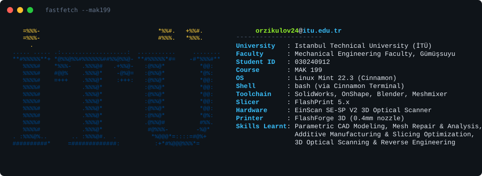

# 🎓 MAK 199: Introduction to CAD &amp; Additive Manufacturing

Welcome to my documentation archive for **MAK 199 (CRN 24595)** at **Istanbul Technical University (İTÜ)**. 

Rather than treating these weekly laboratory sessions as routine academic hurdles, I've opened this repository to document a rapid-prototyping journey. In this class, I've had the chance to experiment with a diverse stack of design and engineering tools—moving between **AutoCAD, FreeCAD, Fusion 360, SolidWorks, OnShape, Blender, and Meshmixer** to explore, refine, and physically manufacture complex mechanical geometries.

My core workflows revolve around:
- 📐 **Parametric CAD Modeling:** Developing precise, constraint-driven digital twins using **OnShape** and **SolidWorks**.
- ⬢ **Mesh Processing:** Utilizing **Blender** and **Meshmixer** to repair scanned meshes, calculate volumetric dimensions, and execute creative geometry manipulation.
- 🖨️ **Additive Manufacturing:** Slicing and preparing models under custom limits using **FlashPrint**—exploring infill topology, layer resolutions, and sacrificial supports.

---

## 🧭 Repository Core Directives

* 🔍 **Physical-to-Digital Integrity:** Every physical part I measured or scanned is backed by an active, version-controlled digital twin.
* 🛠️ **Open & Adaptable Toolchain:** Fluently translating models across CAD, mesh, and slicing software depending on the manufacturing requirements.
* ⚡ **Operational Discipline:** Each sprint is guided by real engineering constraints (e.g., severe print time limits, strict validation formats, and material conservation).

---

## 📂 Engineering Sprints & Case Studies

| Code | Lab Directory | Core Mission & Technical Focus |
| :---: | :--- | :--- |
| **01** | [`Lab-01-Metrology-Component-01`](./Lab-01-Metrology-Component-01/) | **Caliper Metrology:** Translating physical castings into geometric CAD constraints. |
| **02** | [`Lab-02-Metrology-Component-02`](./Lab-02-Metrology-Component-02/) | **Constraint Verification:** Handling complex layouts under strict verification criteria. |
| **03** | [`Lab-03-Metrology-Component-03`](./Lab-03-Metrology-Component-03/) | **Industrial Sheets:** Generating standardized orthographic projections from digital twins. |
| **04** | [`Lab-04-Optical-Scanning-Dental`](./Lab-04-Optical-Scanning-Dental/) | **Point Cloud Processing:** Converting unstructured dental scanning clouds into verifiable STL meshes. |
| **05** | [`Lab-05-Optical-Scanning-Texture`](./Lab-05-Optical-Scanning-Texture/) | **Color Map Alignment:** Managing 36-step rotary scans with HDR (Ataturk Model). |
| **06** | [`Lab-06-Optical-Scanning-HumanHead`](./Lab-06-Optical-Scanning-HumanHead/) | **Optical Capture:** Deploying HDR modes to scan highly non-linear, organic head geometries. |
| **07** | [`Lab-07-Slicing-Parametric-Optimization`](./Lab-07-Slicing-Parametric-Optimization/) | **Slicing Mechanics:** Mapping layer heights and volumetric infill topologies against print time. |
| **08** | [`Lab-08-Rapid-Prototyping-Cycle`](./Lab-08-Rapid-Prototyping-Cycle/) | **Cycle Constraints:** Tuning speed, infill, and layer height to execute a physical print under a 15-minute ceiling. |
| **09** | [`Lab-09-Support-Structure-Design`](./Lab-09-Support-Structure-Design/) | **Sacrificial Geometry:** Evaluating overhang vectors, tree/wall supports, and PVA on a *Bugbear* model. |
| **10** | [`Lab-10-Post-Processing-Validation`](./Lab-10-Post-Processing-Validation/) | **Post-Processing:** Managing the physical transition from integrated supports to a clean, structural fan. |
| **11** | [`Lab-11-Infill-Topology-Research`](./Lab-11-Infill-Topology-Research/) | **Internal Lattice Optimization:** Evaluating structural efficiency, density patterns, and manufacturing economy. |

---

## 🌐 Central Repositories & Artifacts

* 📄 **Verified Engineering Dossiers:** [Google Drive Hub](https://drive.google.com/drive/folders/1KTj06oLOuWI0tRQjvCxtkhKTh3z050OP?usp=drive_link)

> 🔐 **Verification Notice:** To ensure data authenticity, all manual sketches carry personal validation signatures, and digital modeling screenshots are paired directly with physical student identification cards.
